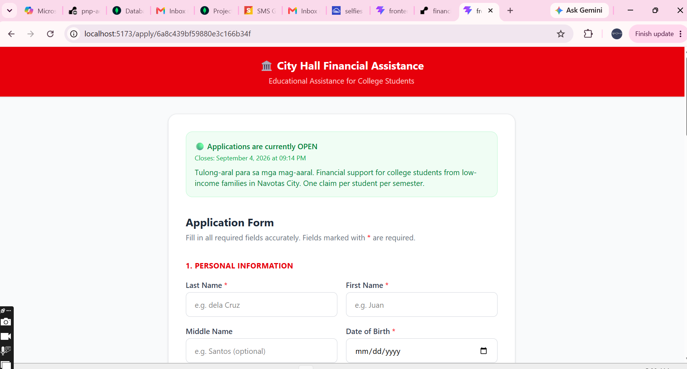
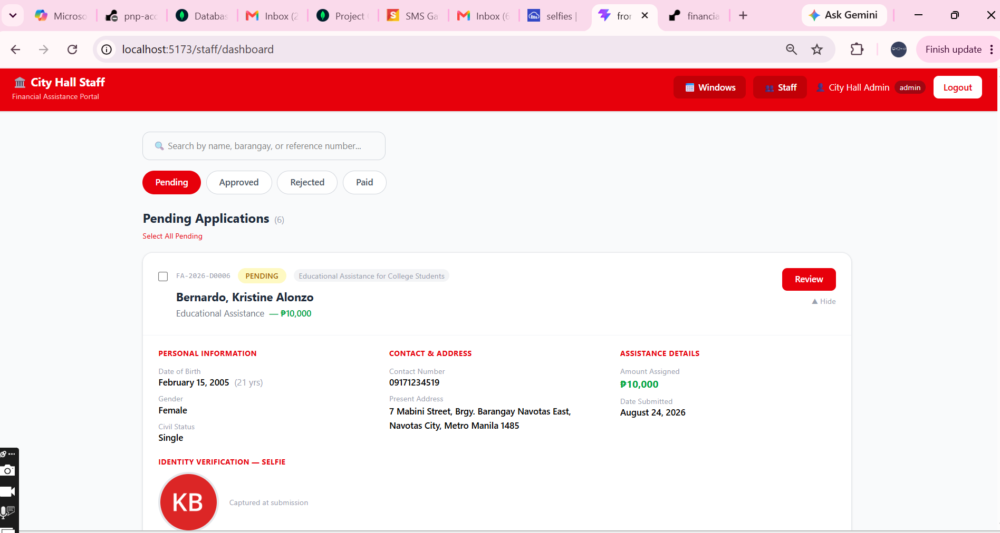
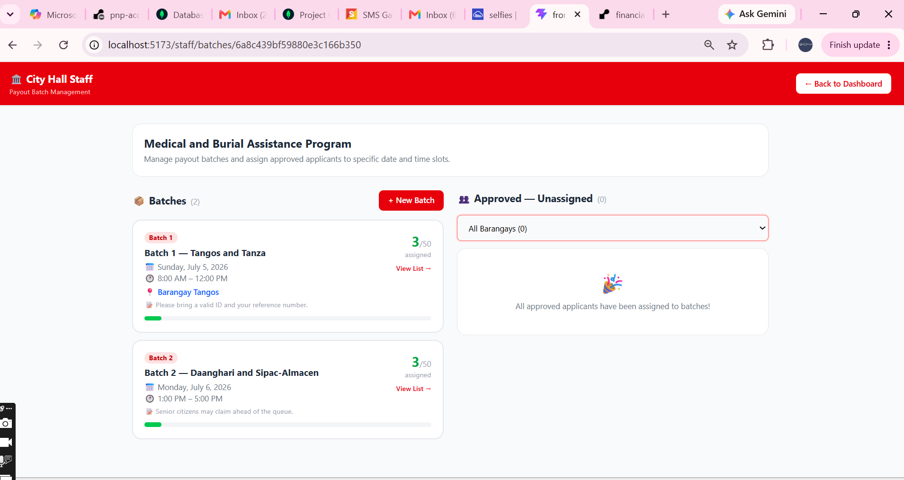
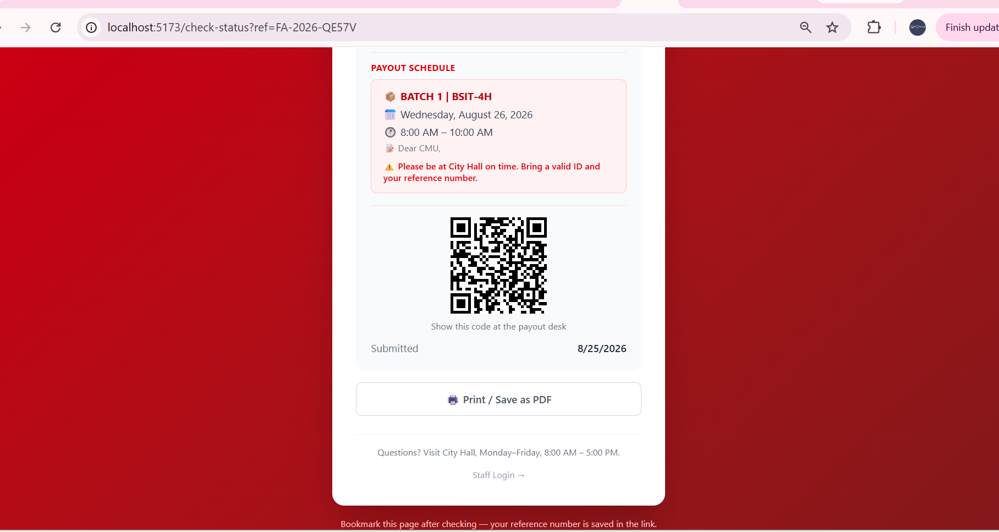

# 🏛️ Financial Assistance System

A full-stack web application for city government financial assistance programs.
Community members apply online through a shareable link — no account registration,
no queueing at City Hall to submit a form. Staff review applications, schedule
payouts into timed batches, and notify applicants automatically.

Built to replace a paper-and-queue process that costs applicants a day of work
and City Hall staff a filing cabinet.

---

## 🌐 Live Demo

| | |
|---|---|
| **Status Checker** | https://cute-gaufre-42f141.netlify.app/check-status |
| **Staff Portal** | https://cute-gaufre-42f141.netlify.app/staff/login |
| **Application Form** | Generated per window from the Staff Dashboard — copy the link from the Windows page |

> ⏱️ **First load may take up to a minute.** The backend runs on Render's free
> tier, which spins down after inactivity. Subsequent requests are fast.

### Demo Credentials

| Role | Email | Password |
|------|-------|----------|
| Staff | demo@cityhall.gov.ph | *(DemoStaff2026)* |

The demo account has the `staff` role — it can review applications and manage
batches, but not create or modify staff accounts. Admin functions are excluded
from the public demo deliberately.

---

## 📸 Screenshots

| Public application form | Staff dashboard |
|---|---|
|  |  |

| Payout batch manager | Status checker |
|---|---|
|  |  |

---

## ✨ Features

### Public — no login required

- Applications open only during admin-defined windows, validated server-side
- Form reachable by shareable link, one link per window
- Selfie capture for identity verification at the payout desk
- Duplicate prevention enforced at the database level (case-insensitive, per window)
- Amount assigned automatically from the window's per-type configuration
- Reference number issued on submission, with a QR code for later lookup
- Status checker: pending, approved, scheduled, or paid — printable and
  downloadable as an image
- Email confirmation at submission and at every status change

### Staff portal

- JWT authentication with server-side role checks on every request
- Create and manage application windows, with overlap prevention
- Per-assistance-type amounts configured per window
- Review applications individually or in bulk
- **Payout batch scheduling** — assign approved applicants to a date, time slot,
  and capacity; applicants are notified with their exact slot
- Cross-window claim history surfaced during review
- Search by name, barangay, or reference number
- Excel export with formatting and per-window summaries
- Analytics: totals by status, assistance type, barangay, gender, civil status,
  and submissions over time
- Staff account management (admin only)

### Business rules enforced

- Applicants must be 18 or over
- One application per person per window
- **Three-month cooling-off period** after a payout, keyed to the date the money
  was actually released rather than the approval date
- Amounts cannot be assigned where the window has none configured for that type

---

## 🛠️ Tech Stack

**Backend** — Node.js, Express, MongoDB with Mongoose, JWT, Multer, Cloudinary,
Nodemailer (Gmail), Semaphore (SMS), ExcelJS, Helmet, express-rate-limit,
compression

**Frontend** — React, Vite, React Router, Tailwind CSS, Recharts, qrcode.react,
html2canvas-pro, Axios

**Deployment** — Render (backend), Netlify (frontend), MongoDB Atlas (database),
Cloudinary (image storage)

---

## 🧠 Notable Decisions

The parts of this project that took the most thought.

### Auth verifies against the database, not the token

The obvious JWT implementation reads the user's role straight from the token
payload. That means deactivating a staff account does nothing until their token
expires — for a system that authorizes payments, a fired employee keeps approving
disbursements for the rest of the week.

Every authenticated request now does a database lookup and reads both the
account's active status and its role from the record, not the token. Deactivation
and demotion take effect on the next request. It costs one indexed query per
request, which is negligible next to what the route does anyway.

### Notification failures never roll back a submission

Originally, the SMS call sat after the database write with no error handling. If
the SMS provider was down, the throw landed in the catch block and returned a 500
— but the application was already saved. The applicant saw "submission failed,"
resubmitted, and hit the duplicate check for a submission they'd been told didn't
exist.

Notifications are now non-blocking and never affect the response. Bulk operations
go further: all database writes complete, the HTTP response is sent, and only then
do notifications go out. Approving fifty applicants doesn't hold the browser open
for a hundred network round-trips.

### Reference numbers aren't sequential

Generating them from a document count means deleting one record makes the next
submission collide with an existing number — and two simultaneous submissions
collide with each other. With a unique index on the field, that's a hard failure
the applicant sees as "submission failed," permanently, with no way forward.

They're now derived from a base-36 timestamp: short enough to read over the phone,
unique without coordination, and still roughly chronological.

### Repeat claimants are surfaced, not blocked

Cross-window duplicate claiming is the obvious fraud vector for an assistance
program. But the system can't distinguish fraud from real need — someone who
received burial assistance in March and needs medical assistance in August is not
committing fraud.

The reviewer sees prior claims and their totals when they open an application.
The decision stays human. The only automatic rule is the three-month cooling-off
period, which is policy rather than a judgement call.

### Images live off the server

Render's filesystem is ephemeral: every deploy, restart, or idle spin-down wipes
uploaded files. A selfie uploaded in the morning was gone by afternoon, and the
resulting broken image looked identical to a bug in the display code.

Uploads go to Cloudinary. Rejected submissions have their image deleted, so a
failed application doesn't leave an orphan behind.

---

## 🚀 Running Locally

### Prerequisites

Node.js 18+, a MongoDB Atlas cluster, a Cloudinary account, and a Gmail account
with an app password. Semaphore is optional — SMS degrades gracefully if it isn't
configured.

### Setup

```bash
git clone <repo-url>
cd financial-assistance-system

# Backend
cd backend
npm install
cp .env.example .env    # then fill in the values below
npm run dev             # http://localhost:5001

# Frontend (separate terminal)
cd ../frontend
npm install
npm run dev             # http://localhost:5173
```

### Environment variables

`backend/.env`:

| Variable | Purpose |
|---|---|
| `PORT` | API port (default 5001) |
| `MONGO_URI` | MongoDB Atlas connection string |
| `JWT_SECRET` | Token signing key — generate with `node -e "console.log(require('crypto').randomBytes(64).toString('hex'))"` |
| `FRONTEND_URL` | Origin allowed by CORS, no trailing slash |
| `NODE_ENV` | `development` or `production` |
| `CLOUDINARY_NAME` | Cloudinary cloud name |
| `CLOUDINARY_KEY` | Cloudinary API key |
| `CLOUDINARY_SECRET` | Cloudinary API secret |
| `GMAIL_USER` | Gmail address for outgoing mail |
| `GMAIL_PASS` | Gmail **app password**, not the account password |
| `SEMAPHORE_API_KEY` | Optional — SMS is skipped if absent |
| `SEMAPHORE_SENDER_NAME` | Optional — registered sender name |

The server exits at startup if `JWT_SECRET` or `MONGO_URI` is missing, rather than
failing later with a misleading authentication error.

### Seeding demo data

```bash
cd backend
node scripts/seed-demo.js
```

Creates three application windows, twenty applications across every status, and
two payout batches. Requires an existing admin account.

---

## 📁 Project Structure

```
backend/
  models/          Application, ApplicationWindow, PayoutBatch, Staff
  routes/          applicationRoutes, windowRoutes, batchRoutes, staffRoutes
  middleware/      authMiddleware — staff and admin guards
  services/        smsService (Semaphore), emailService (Nodemailer)
  scripts/         seed-demo
  server.js

frontend/src/
  pages/           Apply, Success, StatusChecker
  pages/staff/     Login, Dashboard, WindowManager, BatchManager,
                   StaffManager, Analytics
  components/      SelfieCapture
  api.js           Axios instance with auth interceptor
```

---

## 🔒 Security Notes

- Passwords hashed with bcrypt (cost 12), never returned by any query
- Staff tokens expire after 8 hours; deactivation revokes access immediately
- Rate limiting: 500 requests per 15 minutes globally, 10 on staff login
- Helmet security headers, with cross-origin resource policy configured for
  image delivery
- User input escaped before interpolation into HTML email templates
- Regex inputs escaped before use in database queries
- Every validation rule enforced server-side; client-side checks are for
  usability only

---

## 🗺️ Roadmap

- Audit log of every state change, viewable by admins
- Attendance tracking at the payout desk
- Per-window budget ceilings with warnings as approvals approach the limit
- Tagalog / English toggle on public pages
- Migrate `dateOfBirth` from string to date for age-bracket analytics

---

## 📄 License

MIT
